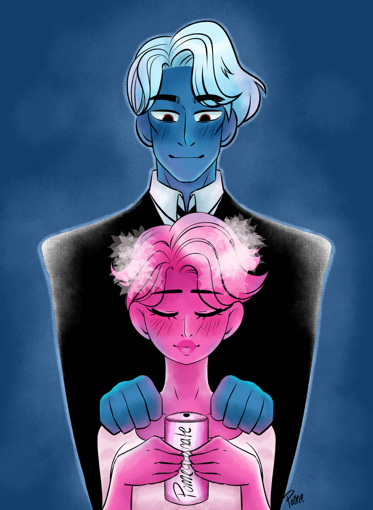

# **MIDTERM PROJECT**

## Milestone 1

### OVERVIEW
The goal of this project is to recreate a book cover using code. The catch is that the book cover must either be interactive via mouse actions or that some part of it must change with time. The book that I have read most recently is a manga called Lore Olympus. I thought that I would enjoy depicting this one, as the characters are colorful and possess unique shapes and features already. Lore Olympus Volume 1 is about Persephone, the goddess of spring and Hades, the god of the underworld, falling in love with one another. It goes through them meeting, Persephone being warned to stay away from him, and their eventual realization of the love they have for one another before leading into volume 2. 

---

### PLAN
For my cover, I wanted to include an image of either simply Persephone and Hades or all of the main characters of the story as I think it would be fun to depict them all. I started by darfting a plan for a cover with Persephone and Hades alone. I wanted to show the traditional story of our seasons -- how Persphone spends winters in the underworld with Hades, and spends spring through fall with her mother Demeter. I thought of making the seasons change with the passing of time. In my sketch below, I mapped out the shapes needed to make Persephone and the shapes needed to depict Hades.
 

Persephone:
- 1 rectangle and triangle for hair
- 1 trapezoid for head
- 2 lined circles for eyes
- 2 half circles for pupils

Hades:
- 1 circle for head
- 2 triangles for hair
- 2 lined circles for eyes
- 2 half circles for pupils

I also thought about how I wanted to depict the season changes and figured I could do this by changing the shapes on the trees. In spring and summer, there are flowers (which I am not sure how to make just yet) and in the fall there are leaves and snowflakes for winter. Ideally, I would want to incorporate an aspect where Hades dissapears in spring through fall and reappears each winter. I also would want this to change with every minute so that users do not have to wait long periods of time to see the season change. I also would like to incorporate other prominent characters such as:

- Demeter: Goddess of Harvest and the mother of Persephone 
- Artemis: Goddess of Hunt and roommate of Persephone
- Zeus: God of Thunder and brother of Hades
- Hera: Goddess of Marriage and wife of Zeus

## Milestone 2

### LOGIC
My scene will be split into 3 different moments: spring and summer, fall, and winter. The events will be time-based rather than initiated by mouse actions. To change the flowers into leaves and then into snowflakes, I will likely need to make objects for the flowers, leaves, and snowflakes. This way, I can easily change between them in time intervals. 

I ended up creating a function for each of the static drawings -- Persephone, Hades, and the Trees. This way, I could easily adjust them and call them if needed in the draw section. This came in handy when I changed my canvas/window size and then needed to agjust the placement of Persephone. The following pseudocode helped me to organize my thoughts.

!(MidTerm1.jpg)
!(MidTerm2.jpg)
!(MidTerm3.jpg)